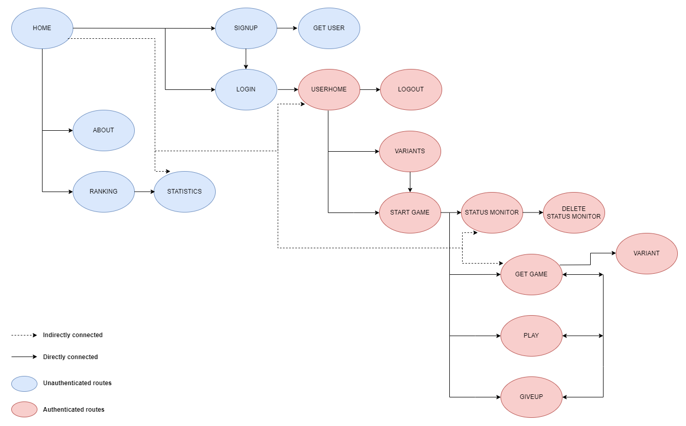

# Gomoku API Documentation

The document describes the API.

## Table of Contents

- [Home Resources](#home)
- [System Resources](#system)
- [Users Resources](#users)
- [Games Resources](#games)
- [Media Types](#media-types)
- [Request Details](#request-details)
- [Response Details](#response-details)
- [Navigation Graph](#navigation-graph)

---


## Home

Gets the home resource, mainly with the primary (direct connected) and global (indirect connected) navigation links and actions.
See [Navigation Graph](#navigation-graph).

**Request**
- **Method**: ``GET``
- **Path**: ``/api/``

**Response**
- **Success**:
  - **Headers**:
    - Content-Type: ["application/vnd.siren+json"](#applicationvndsirenjson)
- **Failure**:
  - **Headers**:
    - Content-Type: ["application/problem+json"](#applicationproblemjson)


---


## System

### About

Gets the about resource, mainly with information about the current version of the system and information about the respective developers.

**Request**
- **Method**: ``GET``
- **Path**: ``/api/system``

**Response**
- **Success**:
  - **Headers**:
    - Content-Type: ["application/vnd.siren+json"](#applicationvndsirenjson)
- **Failure**:
  - **Headers**:
    - Content-Type: ["application/problem+json"](#applicationproblemjson)


---


## Users

### Ranking

Gets the current paged ranking of users, mainly with information on the total number of users and the statistics of each one on that page.
Furthermore, there is a related link to each individual's user statistics.

**Request**
- **Method**: ``GET``
- **Path**: ``/api/users/ranking``
- [ **Query** ``?page=__`` ]

**Response**
- **Success**:
  - **Headers**:
    - Content-Type: ["application/vnd.siren+json"](#applicationvndsirenjson)
- **Failure**:
  - **Headers**:
    - Content-Type: ["application/problem+json"](#applicationproblemjson)


### Statistics

Gets a user's statistics, mainly the number of games played, won, lost and tied.

**Request**
- **Method**: ``GET``
- **Path**: ``/api/users/{userId}/statistics``

**Response**
- **Success**:
  - **Headers**:
    - Content-Type: ["application/vnd.siren+json"](#applicationvndsirenjson)
- **Failure**:
  - **Headers**:
    - Content-Type: ["application/problem+json"](#applicationproblemjson)


### SignUp (Create User)

Creates a user with necessary information.

**Request**
- **Method**: ``POST``
- **Path**: ``/api/users``
- **Headers**:
  - Content-Type: ["application/json"](#applicationjson)
- **Body**:
  ```
  {
      "username": text,
      "email": text,
      "password": text
  }
  ```

**Response**
- **Success**:
  - **Headers**:
    - Content-Type: ["application/vnd.siren+json"](#applicationvndsirenjson)
    - Location
- **Failure**:
  - **Headers**:
    - Content-Type: ["application/problem+json"](#applicationproblemjson)


---


### LogIn (Create Token)

Create a temporary token for access to resources that require authorization.

**Request**
- **Method**: ``POST``
- **Path**: ``/api/users/token``
- **Headers**:
  - Content-Type: ["application/json"](#applicationjson)
- **Body**:
  ```
  {
      "identity": text,
      "password": text
  }
  ```

**Response**
- **Success**:
  - **Headers**:
    - Content-Type: ["application/vnd.siren+json"](#applicationvndsirenjson)
- **Failure**:
  - **Headers**:
    - Content-Type: ["application/problem+json"](#applicationproblemjson)


---


### GetUser

Gets a user's public information.

**Request**
- Method: ``GET``
- Path: ``/api/users/{userId}``

**Response**
- **Success**:
  - **Headers**:
    - Content-Type: ["application/vnd.siren+json"](#applicationvndsirenjson)
- **Failure**:
  - **Headers**:
    - Content-Type: ["application/problem+json"](#applicationproblemjson)


### Logout

Invalidate a temporary token created for access to resources that require authorization.

**Request**
- Method: ``POST``
- Path: ``/api/logout``
- **Headers**:
  - [Authorization](#authorization)

**Response**
- **Success**:
  - **Headers**:
    - Content-Type: null
- **Failure**:
  - **Headers**:
    - Content-Type: ["application/problem+json"](#applicationproblemjson)


### UserHome

Gets a user's personal information and the links and actions within the account.

**Request**
- Method: ``GET``
- Path: ``/api/me``
- **Headers**:
  - [Authorization](#authorization)

**Response**
- **Success**:
  - **Headers**:
    - Content-Type: ["application/vnd.siren+json"](#applicationvndsirenjson)
- **Failure**:
  - **Headers**:
    - Content-Type: ["application/problem+json"](#applicationproblemjson)


---


## Games

### Variants

Gets information of all supported variants.

**Request**
- Method: ``GET``
- Path: ``/api/games/variants``
- **Headers**:
  - [Authorization](#authorization)

**Response**
- **Success**:
  - **Headers**:
    - Content-Type: ["application/vnd.siren+json"](#applicationvndsirenjson)
- **Failure**:
  - **Headers**:
    - Content-Type: ["application/problem+json"](#applicationproblemjson)


### Variant

Gets information for one of the supported variants.

**Request**
- Method: ``GET``
- Path: ``/api/games/variants/{variantId}``
- **Headers**:
  - [Authorization](#authorization)

**Response**
- **Success**:
  - **Headers**:
    - Content-Type: ["application/vnd.siren+json"](#applicationvndsirenjson)
- **Failure**:
  - **Headers**:
    - Content-Type: ["application/problem+json"](#applicationproblemjson)


### Start

Express a desire to start a game. There are two scenarios if it is successful. 
In the first scenario, the request was registered, i.e., as there is currently no other player waiting to play, 
the request is registered and it is possible to monitor the starting status of the game. 
In the second case the game was started, i.e., as there was a player waiting, the game could be started.

**NOTE**:
__The user who waited for the other user play with the black pieces (player b) and the user who joined the game will play 
with the white pieces (player w).__

**Request**
- **Method**: ``POST``
- **Path**: ``/api/games``
- **Headers**:
  - [Authorization](#authorization)
  - Content-Type: ["application/json"](#applicationjson)
- [ **Body**: ]
```
{
    "variantId": Int
}
```

**Response**
- **Success**:
  - **Headers**:
    - Content-Type: ["application/vnd.siren+json"](#applicationvndsirenjson)
- **Failure**:
  - **Headers**:
    - Content-Type: ["application/problem+json"](#applicationproblemjson)


### StatusMonitor

Get the status of the game start monitor. 
There are two scenarios if it is successful, either the player continues waiting or someone has already joined.

**Request**
- **Method**: ``GET``
- **Path**: ``/api/games/{gameId}/monitor``
- **Headers**:
  - [Authorization](#authorization)

**Response**
- **Success**:
  - **Headers**:
    - Content-Type: ["application/vnd.siren+json"](#applicationvndsirenjson)
- **Failure**:
  - **Headers**:
    - Content-Type: ["application/problem+json"](#applicationproblemjson)


### DeleteMonitor

Give up waiting for other player.

**Request**
- **Method**: ``DELETE``
- **Method**: ``/api/games/{gameId}/monitor``
- **Headers**:
  - [Authorization](#authorization)

**Response**
- **Success**:
  - **Headers**:
    - Content-Type: null
- **Failure**:
  - **Headers**:
    - Content-Type: ["application/problem+json"](#applicationproblemjson)


### GetGame

Get current game status.

**Request**
- **Method**: ``GET``
- **Path**: ``/api/games/{gameId}``
- **Headers**:
  - [Authorization](#authorization)

**Response**
- **Success**:
  - **Headers**:
    - Content-Type: ["application/vnd.siren+json"](#applicationvndsirenjson)
- **Failure**:
  - **Headers**:
    - Content-Type: ["application/problem+json"](#applicationproblemjson)


### Play

Apply a move to a game.

**Request**
- **Method**: ``PUT``
- **Path**: ``/api/games/{gameId}/play/row/{row}/column/{column}``
- **Headers**:
  - [Authorization](#authorization)

**Response**
- **Success**:
  - **Headers**:
    - Content-Type: ["application/vnd.siren+json"](#applicationvndsirenjson)
- **Failure**:
  - **Headers**:
    - Content-Type: ["application/problem+json"](#applicationproblemjson)


### GiveUp

Quit a game.

__NOTE: Quitting a game means another game played and a game lost in the statistics.__

**Request**
- **Method**: ``PUT``
- **Path**: ``/api/games/{gameId}/giveup``
- **Headers**:
  - [Authorization](#authorization)

**Response**
- **Success**:
  - **Headers**:
    - Content-Type: null
- **Failure**:
  - **Headers**:
    - Content-Type: ["application/problem+json"](#applicationproblemjson)

---


## Media Types

### **application/vnd.siren+json**

__Media type for success responses according to [Siren (Hypermedia)](https://github.com/kevinswiber/siren).__

| **Custom __Link Relation__**                                                           | **Description**                                                                            |
|----------------------------------------------------------------------------------------|--------------------------------------------------------------------------------------------|
| https://github.com/isel-leic-daw/2023-daw-leic51d-07/tree/main/docs/api/rel/about      | Refers to a resource that contains information about the system version and the author(s). |
| https://github.com/isel-leic-daw/2023-daw-leic51d-07/tree/main/docs/api/rel/ranking    | Refers to a resource that contains the paginated ranking of users.                         |
| https://github.com/isel-leic-daw/2023-daw-leic51d-07/tree/main/docs/api/rel/statistics | Refers to a resource that contains a user's statistics.                                    |
| https://github.com/isel-leic-daw/2023-daw-leic51d-07/tree/main/docs/api/rel/userHome   | Refers to a resource that contains a user's personal information.                          |
| https://github.com/isel-leic-daw/2023-daw-leic51d-07/tree/main/docs/api/rel/variants   | Refers to a resource that contains the information of all supported variants.              |
| https://github.com/isel-leic-daw/2023-daw-leic51d-07/tree/main/docs/api/rel/game       | Refers to a resource that contains the information of a game.                              |
| https://github.com/isel-leic-daw/2023-daw-leic51d-07/tree/main/docs/api/rel/monitor    | Refers to a resource that contains the information of a game start status monitor.         |


| **Custom __Action__** | **Description**                                                                        |
|-----------------------|----------------------------------------------------------------------------------------|
| signup                | Action to create a user.                                                               |
| login                 | Action to create a temporary token to access resources that require authorization.     |
| logout                | Action to inactivate a temporary token to access resources that require authorization. |
| start-game            | Action to express desire in starting a game.                                           |
| cancel                | Action to cancel waiting for another user to start a game.                             |
| play                  | Action to apply a move to a game.                                                      |
| give-up               | Action to quit a game.                                                                 |

NOTE: __The remaining link relations used are described in [IANA - Link Relations](https://www.iana.org/assignments/link-relations/link-relations.xhtml).__

Example of a response with media type __application/vnd.siren+json__:
```
{
    "class": [
        "game"
    ],
    "properties": {
        "gameState": "NEXT_TURN_B",
        "playerB": 1,
        "playerW": 2,
        "playingRoundTime": "5m",
        "pieces": [],
        "variantId": 1
    },
    "links": [
        {
            "rel": [
                "self"
            ],
            "href": "/api/games/ff0d5e34-8c28-49dd-9c0e-6ceafbf9934b",
            "authenticationType": [
                "BEARER",
                "COOKIE"
            ]
        },
        {
            "rel": [
                "https://github.com/isel-leic-daw/2023-daw-leic51d-07/tree/main/docs/api/rel/variant"
            ],
            "href": "/api/games/variants/1",
            "authenticationType": [
                "BEARER",
                "COOKIE"
            ]
        }
    ],
    "entities": [],
    "actions": [
        {
            "name": "play",
            "title": "Make a move",
            "href": "/api/games/{id}/play/row/{row}/column/{column}",
            "method": "PUT",
            "authenticationType": [
                "BEARER",
                "COOKIE"
            ],
            "fields": []
        },
        {
            "name": "give-up",
            "title": "Give up on game",
            "href": "/api/games/ff0d5e34-8c28-49dd-9c0e-6ceafbf9934b/giveup",
            "method": "PUT",
            "authenticationType": [
                "BEARER",
                "COOKIE"
            ],
            "fields": []
        }
    ]
}
```

### **application/json**

__Media type for body requests type according to [RFC 4627](https://www.rfc-editor.org/rfc/rfc4627).__

### **application/problem+json**

__Media type for failure responses according to [RFC 7807](https://datatracker.ietf.org/doc/html/rfc7807).__

| **Custom __Type Field__**                                                                             | **Description**                                                   |
|-------------------------------------------------------------------------------------------------------|-------------------------------------------------------------------|
| https://github.com/isel-leic-daw/2023-daw-leic51d-07/tree/main/docs/api/problem/userNotFound          | The requested user was not found.                                 |
| https://github.com/isel-leic-daw/2023-daw-leic51d-07/tree/main/docs/api/problem/userAlreadyExists     | The user already exists.                                          |
| https://github.com/isel-leic-daw/2023-daw-leic51d-07/tree/main/docs/api/problem/insecurePassword      | The chosen password is not secure.                                |
| https://github.com/isel-leic-daw/2023-daw-leic51d-07/tree/main/docs/api/problem/emailNotValid         | The chosen email does not have a valid format.                    |
| https://github.com/isel-leic-daw/2023-daw-leic51d-07/tree/main/docs/api/problem/invalidCredentials    | The credentials indicated are not valid.                          |
| https://github.com/isel-leic-daw/2023-daw-leic51d-07/tree/main/docs/api/problem/playerAlreadyWaiting  | The player is already waiting for another player to start a game. |
| https://github.com/isel-leic-daw/2023-daw-leic51d-07/tree/main/docs/api/problem/invalidVariant        | The requested variant are not valid.                              |
| https://github.com/isel-leic-daw/2023-daw-leic51d-07/tree/main/docs/api/problem/monitorNotFound       | The requested status monitor was not found.                       |
| https://github.com/isel-leic-daw/2023-daw-leic51d-07/tree/main/docs/api/problem/gameNotFound          | The requested game was not found.                                 |
| https://github.com/isel-leic-daw/2023-daw-leic51d-07/tree/main/docs/api/problem/playerNotPartOfGame   | The player is not one of the players in the requested game.       |
| https://github.com/isel-leic-daw/2023-daw-leic51d-07/tree/main/docs/api/problem/moveNotValid          | The requested move is not valid.                                  |
| https://github.com/isel-leic-daw/2023-daw-leic51d-07/tree/main/docs/api/problem/gameAlreadyEnded      | The requested game has ended.                                     |
| https://github.com/isel-leic-daw/2023-daw-leic51d-07/tree/main/docs/api/problem/notYourTurn           | It's not the player's turn to play.                               |
| https://github.com/isel-leic-daw/2023-daw-leic51d-07/tree/main/docs/api/problem/timeOut               | The time limit for making a move has been exceeded.               |
| https://github.com/isel-leic-daw/2023-daw-leic51d-07/tree/main/docs/api/problem/invalidRequestContent | The content of the request is not valid.                          |
| https://github.com/isel-leic-daw/2023-daw-leic51d-07/tree/main/docs/api/problem/internalServerError   | Something went wrong. Please try again later.                     |

Example of a response with media type __application/problem+json__:
```
{
    "type": "https://github.com/isel-leic-daw/2023-daw-leic51d-07/tree/main/docs/api/problem/gameNotFound",
    "title": "Game not found.",
    "detail": "Game with id 'ff0d5e34-8c28-49dd-9c0e-06ceafbf9934' not found."
}
```

## Request Details

| **__Path__ field** | **Type** | **Description**                                                                                                                 |
|--------------------|----------|---------------------------------------------------------------------------------------------------------------------------------|
| userId             | number   | User identifier.                                                                                                                |
| gameId             | number   | Game identifier.                                                                                                                |
| variantId          | number   | Variant identifier.                                                                                                             |
| row                | number   | Board row where you want to play. The first position in the row is 0 and last is boardDim - 1 of the chosen game variant.       |
| column             | number   | Board column where you want to play. The first position in the column is 0 and last is boardDim - 1 of the chosen game variant. |

| **__Query__ field** | **Type** | **Description**                                    |
|---------------------|----------|----------------------------------------------------|
| page                | number   | **Optional** intended page in paginated resources. |          

| **__Body__ fields** | **Type** | **Description**                                                                                                                                                                                                                                                                     |
|---------------------|----------|-------------------------------------------------------------------------------------------------------------------------------------------------------------------------------------------------------------------------------------------------------------------------------------|
| username            | text     | Descriptive text about the desired username for the user. The field can not be empty and is **required**.                                                                                                                                                                           |
| email               | text     | Descriptive text about the desired email for the user. The field must match a valid email format, i.e., it must have exactly one _@_ character and at least one _._ character. The field can not be empty and is **required**.                                                      |
| password            | text     | Descriptive text about the desired password for the user. The field must have security requirements, i.e., it must have at least 6 characters, at least one digit, at least one lowercase letter and at least one uppercase letter. The field can not be empty and is **required**. |
| identity            | text     | Descriptive text about user identification of a user. The field may correspond to the username or email indicated when creating the user. The field can not be empty and is **required**.                                                                                           |
| variantId           | number   | Descriptive number about the desired game variant. The field is **optional**.                                                                                                                                                                                                       |    

## Response Details

| **__Class__ value** | **Type** | **Description**                                                                                           |
|---------------------|----------|-----------------------------------------------------------------------------------------------------------|
| home                | text     | Home entity represents primary navigation links.                                                          |
| system-info         | text     | System-Info entity represents information about system, namely system version.                            |
| system-authors      | text     | System-Authors entity represents information about the developers of the current version of the API.      |
| ranking             | text     | Ranking entity represents the current ranking of users' scores.                                           |
| user                | text     | User entity represents the public information of a user.                                                  |
| statistics          | text     | Statistics entity represents the current statistics of requested user.                                    |
| authorization       | text     | Authorization entity represents user authentication for authenticated resource access.                    |
| user-home           | text     | User Home entity represents the user's personal information and the links and actions within the account. |
| variant             | text     | Variant entity represents information of one supported variants.                                          |
| variants            | text     | Variants entity represents information of all supported variants.                                         |
| monitor             | text     | Monitor entity represents the state monitoring "object" while the game is not starting.                   |
| game                | text     | Game entity represents the game.                                                                          |

| **__Property__ name**   | **__Property__ value**                                                                                      | **Type** | **Description**                                                                                                                                                                                                              |
|-------------------------|-------------------------------------------------------------------------------------------------------------|----------|------------------------------------------------------------------------------------------------------------------------------------------------------------------------------------------------------------------------------|
| welcome                 | -                                                                                                           | text     | Welcome message.                                                                                                                                                                                                             |
| version                 | -                                                                                                           | text     | Current version of system, in [Semantic-versioning](https://en.wikipedia.org/wiki/Software_versioning#Semantic_versioning) scheme.                                                                                           |
| createdAt               | -                                                                                                           | text     | Current system version creation date.                                                                                                                                                                                        |
| authors                 | -                                                                                                           | array    | Current system version authors.                                                                                                                                                                                              |
| firstName               | -                                                                                                           | text     | Author's first name.                                                                                                                                                                                                         |  
| surname                 | -                                                                                                           | text     | Author's surname.                                                                                                                                                                                                            | 
| email                   | -                                                                                                           | text     | Author's or User's email.                                                                                                                                                                                                    |
| userId                  | -                                                                                                           | number   | User identifier.                                                                                                                                                                                                             |
| user-{userI}-statistics | -                                                                                                           | text     | The related statistics for user <userId>.                                                                                                                                                                                    |
| username                | -                                                                                                           | text     | User username.                                                                                                                                                                                                               |
| totalUsers              | -                                                                                                           | number   | The current total number of users. The value 0 represents that there is no user.                                                                                                                                             |
| token                   | -                                                                                                           | string   | Temporary token for access to resources that require authorization.                                                                                                                                                          |
| expiration              | -                                                                                                           | string   | Token expiration date and time.                                                                                                                                                                                              |
| rankingPosition         | -                                                                                                           | number   | Current position occupied in the ranking.                                                                                                                                                                                    |
| gamesPlayed             | -                                                                                                           | number   | Number of games played by the user. The value 0 represents that the player has not played any games yet.                                                                                                                     |
| gamesWon                | -                                                                                                           | number   | Number of games won by the user. The value 0 represents that the player has not won any games yet.                                                                                                                           |
| gamesLost               | -                                                                                                           | text     | Number of games lost by the user. The value 0 represents that the player has not lost any games yet.                                                                                                                         |
| gamesTied               | -                                                                                                           | text     | Number of games tied by the user. The value 0 represents that the player has not tied any games yet.                                                                                                                         |
| variants                | -                                                                                                           | array    | Current supported game variants. A variant is a set of boardDim, openingRules and playingRules.                                                                                                                              |
| variantId               | -                                                                                                           | number   | Variant identifier.                                                                                                                                                                                                          |
| boardDim                | -                                                                                                           | number   | The size of game board is boardDim * boardDim.                                                                                                                                                                               |
| openingRules            | 1 - __NONE__                                                                                                | text     | 1 - There are no specific opening rules.                                                                                                                                                                                     |
| playingRules            | 1 - __FREESTYLE__                                                                                           | text     | 1 - The standard game without specific gameplay rules.                                                                                                                                                                       |
| status                  | 1 - __WAITING_FOR_OTHER_PLAYER__ <br> 2 - __OTHER_PLAYER_JOINED__                                           | text     | 1 - Waiting state for another player to start the game. <br> 2 - Terminal state given that another player has already joined and the game has started.                                                                       |
| askAgainIn              | -                                                                                                           | text     | Recommended time (in seconds) to monitor the status once again or 'null' if no longer needed.                                                                                                                                |
| gameState               | 1 - __NEXT_TURN_W__ <br> 2 - __NEXT_TURN_B__  <br> 3 - __WINNER_W__ <br> 4 - __WINNER_B__ <br> 5 - __DRAW__ | text     | 1 - It's the white player's turn. <br> 2 - It's the black player's turn. <br> 3 - The game is over and the white player has won. <br> 4 - The game is over and the black player has won. <br> 5 - The game is over and tied. |
| playerB                 | -                                                                                                           | text     | The identifier of the user who is playing with the black pieces in the current game.                                                                                                                                         |
| playerW                 | -                                                                                                           | text     | The identifier of the user who is playing with the white pieces in the current game.                                                                                                                                         |
| playingRoundTime        | -                                                                                                           | text     | The time to play the round (in minutes).                                                                                                                                                                                     |                 
| pieces                  | -                                                                                                           | array    | All the pieces present on the game board, where each piece corresponds to a player and an intersection.                                                                                                                      |
| player                  | 1 - __B__ <br> 2 - __W__                                                                                    | text     | 1 - Player with the black pieces <br> 2 - Player with the white pieces.                                                                                                                                                      |
| intersection            | -                                                                                                           | object   | Intersection is the position corresponding to a row and a column.                                                                                                                                                            |
| row                     | -                                                                                                           | number   | Board row. The first position in the row is 0 and last is boardDim - 1 of the chosen game variant.                                                                                                                           |
| column                  | -                                                                                                           | number   | Board column. The first position in the column is 0 and last is boardDim - 1 of the chosen game variant.                                                                                                                     |


## Authorization

| **__Field__ name** | **__Field__ value**                                      | **Description**                                                                                                                                                                                                                                                                                                                                                                                                      |
|--------------------|----------------------------------------------------------|----------------------------------------------------------------------------------------------------------------------------------------------------------------------------------------------------------------------------------------------------------------------------------------------------------------------------------------------------------------------------------------------------------------------|
| authenticationType | 1 - __NONE__ <br /> 2 - __BEARER__ <br /> 3 - __COOKIE__ | 1 - The subsequent request does not require authentication to be performed. <br /> 2 - The subsequent request requires authentication to be executed, it requires the inclusion of the authentication header in the HTTP request with the bearer token. <br /> 3 - The subsequent request requires authentication to be executed, it requires the inclusion of the cookie header in the HTTP request with the token. |


## Navigation Graph

The following graph corresponds to the supported navigation graph.


