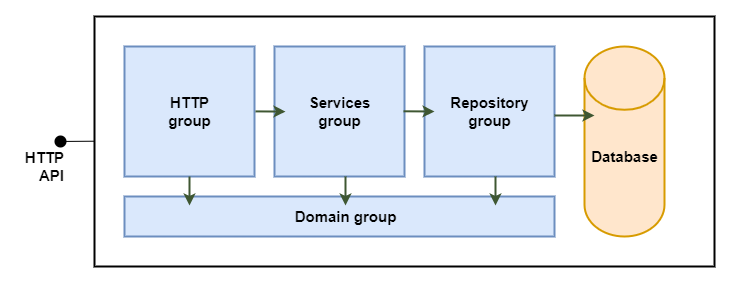
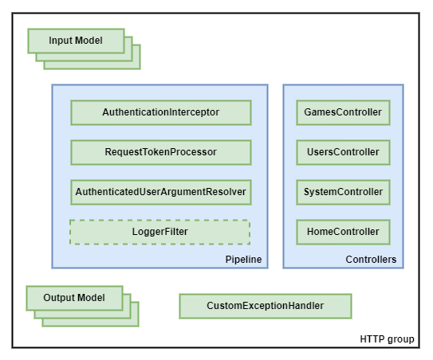
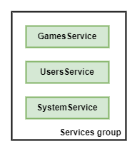
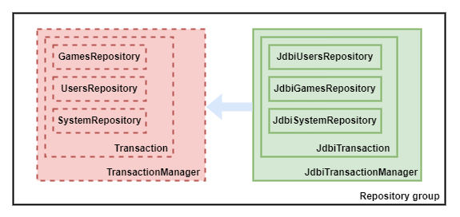
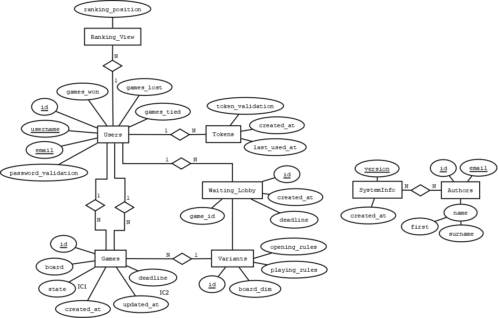

# Backend software organization

The following figure represents the internal backend organization.

This representation can be viewed as two subcomponents:
1. "An application running in the Java Virtual Machine (JVM), exposing the HTTP API for consumption by the frontend and performing interactions with the RDBMS." [1]
2. "A Relational Data Base Management System (RDBMS), holding a relational database with the systems persisted information." [1]

The arrows in the figure represent the dependencies between the groups.

## HTTP group

The following figure represents an abstraction of the http group.

The main purpose of this group is to contains functions and types responsible for exposing and implementing the HTTP API.
This group depends on [Spring MVC](https://docs.spring.io/spring-framework/docs/3.2.x/spring-framework-reference/html/mvc.html)
technology to handle HTTP requests.

The group can be divided into various subgroups:

### Controllers

- [UsersController](../../code/jvm/src/main/kotlin/pt/isel/gomoku/http/UsersController.kt): Functions that handle user-related requests.

- [GamesController](../../code/jvm/src/main/kotlin/pt/isel/gomoku/http/GamesController.kt): Functions that handle game-related requests.

- [SystemController](../../code/jvm/src/main/kotlin/pt/isel/gomoku/http/SystemController.kt): Functions that handle system-related requests.

- [HomeController](../../code/jvm/src/main/kotlin/pt/isel/gomoku/http/HomeController.kt): Functions that handle home-related requests.

### Pipeline

If the route requires authorization, the AuthorizationInterceptor will see if this there is a token in cookies or in the header Authorization. If it doesn't, then it immediately sends back a response with status code 401 without it ever reaching the handler. If it does, then it sends the token to the RequestTokenProcessor so that it can validate it.

The RequestTokenProcessor grabs the token and sees if it's a valid token. If it is valid, then it requests a user that has this token through UsersService. If it exists, it sets a new header named "AuthenticatedUserArgumentResolver" so that the AuthenticatedUserArgumentResolver can grab it and send it as a parameter for the handler.

The LoggerFilter is only for the purpose of logging all requests received and responses generated.

### Models

The input and output models establish formats of request and response messages whilst also creating an abstraction as to how the data is represented in the domain. This allows for these representations to be static, even if the backend suffers drastic changes in regards to data structures.

### CustomExceptionHandler

Used when unknown errors. Can be either due to user input or due to the server.

## Services group

The following figure represents an abstraction of the service group.

The main purpose of this group is to contain the functions and types that provide domain operations.

The Services group is divided into three subgroups:

- [UsersService](../../code/jvm/src/main/kotlin/pt/isel/gomoku/services/UsersService.kt):
  Concrete class with functions that represents different operations related to users.

- [GamesService](../../code/jvm/src/main/kotlin/pt/isel/gomoku/services/GamesService.kt):
  Concrete class with functions that represents different operations related to games.

- [SystemService](../../code/jvm/src/main/kotlin/pt/isel/gomoku/services/SystemService.kt):
  Concrete class with functions that represents different operations related to system.

## Repository group

The main purpose of this group is to contains functions and types to interact with the RDBMS and its database. 
The following figure represents an abstraction of the repository group.

The Repository group is designed to support multiple implementations, however, they must all support the concept of transactions. 
The Repository group is divided into three main subgroups:

- [UsersRepository](../../code/jvm/src/main/kotlin/pt/isel/gomoku/repository/UsersRepository.kt):
  Interface with user-related operation definitions to access the database. To access the database through the use of JDBI,
  the interface is concretely implemented in the form of
  [JdbiUsersRepository](../../code/jvm/src/main/kotlin/pt/isel/gomoku/repository/jdbi/JdbiUsersRepository.kt).

- [GamesRepository](../../code/jvm/src/main/kotlin/pt/isel/gomoku/repository/GamesRepository.kt):
  Interface with game-related operation definitions to access the database. To access the database through the use of JDBI,
  the interface is concretely implemented in the form of
  [JdbiGamesRepository](../../code/jvm/src/main/kotlin/pt/isel/gomoku/repository/jdbi/JdbiGamesRepository.kt).

- [SystemRepository](../../code/jvm/src/main/kotlin/pt/isel/gomoku/repository/SystemRepository.kt):
  Interface with system-related operation definitions to access the database. To access the database through the use of JDBI,
  the interface is concretely implemented in the form of
  [JdbiSystemRepository](../../code/jvm/src/main/kotlin/pt/isel/gomoku/repository/jdbi/JdbiSystemRepository.kt).

## Domain group

The domain group is made up of types and functions that represent domain concepts. 
This is the only group that does not depend on types and functions of any of the other groups, but supports all others.

## Database

[Postgresql](https://www.postgresql.org/) is a Relational Data Base Management System (RDBMS) used to store data.

### Data Model

The following figure represents a data model to support backend implementation.

Integrity constraints:

1. [IC1] The _state_ attribute of the _Games_ entity can only assume the following types: NEXT_TURN_B, NEXT_TURN_W, WINNER_B, WINNER_W, DRAW.

2. [IC2] The value of the _updated_at_ attribute of the _Games_ entity must be equal to or greater than the _created_at_ attribute. The value of the _deadline_ attribute of the _Games_ entity must be greater than _created_at_ attribute.

----

# Main implementation challenges

## 1. Users Ranking

There was a necessity to store a user's statistics, like games played and games won, while also ranking all users based on these statistics. This couldn't be done in the table of Users, as this implied that when a user's statistics changed, everyone's ranking could change as a result, thus impacting the performance of the interactions with the database when a game was completed.

To resolve this issue, a view was made based on the Users table. This view, named Ranking_View, contained the ranking of each user (determined by winrate). Because of this view, every completed game would implicitly trigger an update to the view, automatically changing the users' ranking. This was much faster because this was done in the background instead of being explicitly done through a PSQL query.

## 2. Matchmaking algorithm concurrency

When the matchmaking was being implemented, it was understood that there was going to be a concurrency problem where multiple people could want to start a game while at least one person would be waiting. If everyone saw this game creation request, everyone would try and create a game with this user. This could cause an issue where users would create games that have already existed. This is due to the future game's ID being present on the game creation request.

To resolve this problem, PSQL queries were modified to now include exclusive locks (type X / for update in postgreSQL) when accessing the table Waiting_Lobby. This ensured that only one person would be able to read the table while other queries would be delayed. When that game is created, other queries would not see that previous request, either observing other requests and trying to make games with them or register their own request in the Waiting_Lobby.

With this, there is no apparent concurrency problem in matchmaking.

## 3. Users creation concurrency

When creating a user, between checking whether the user already exists and its insertion, in concurrency another transaction 
may make an insertion between verification and creation. 

To overcome the issue, we leveraged duplicate key validation by the database to ensure there was no error on the server.

With this, there is no apparent concurrency problem in user creation.

----

# Bibliography:

1. [Backend code organization](https://github.com/isel-leic-daw/s2324i-51d-51n-public/blob/main/docs/lecture-notes/02-0-backend-code-organization.adoc)