# Frontend software organization

The application is composed by a static [Index html](../../code/js/public/index.html) file and the initial loading of the 
links and actions of the home siren representation and the application render happen in the [Index file](../../code/js/src/index.tsx).

The application has 7 bookmarked pages with the respective components in [pages folder](../../code/js/src/pages):
- [Home Page](#home-page)
- [Login Page](#login-page)
- [SignUp Page](#signup-page)
- [Me Page](#me-page)
- [Ranking Page](#ranking-page)
- [User Statistics Page](#user-statistics-page)
- [Game Page](#game-page)

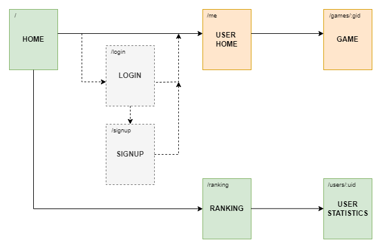

This pages appear in the frontend router of the [App file](../../code/js/src/App.tsx).

Other components that do not represent pages but help with their composition are in the [components' folder](../../code/js/src/components).

The domain classes that support the pages are in [domain folder](../../code/js/src/domain).

Utility types and functions are in sub-folders of the [utils folder](../../code/js/src/utils).

The API interactions are in the [http folder](../../code/js/src/http).

---

## Home Page

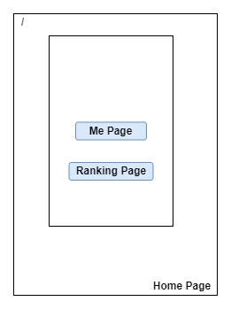

It doesn't need a state machine because it's a static page.

---

## Login Page

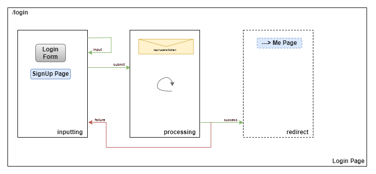

### State Machine

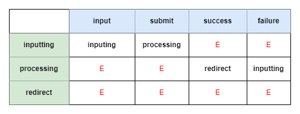

---

## SignUp Page

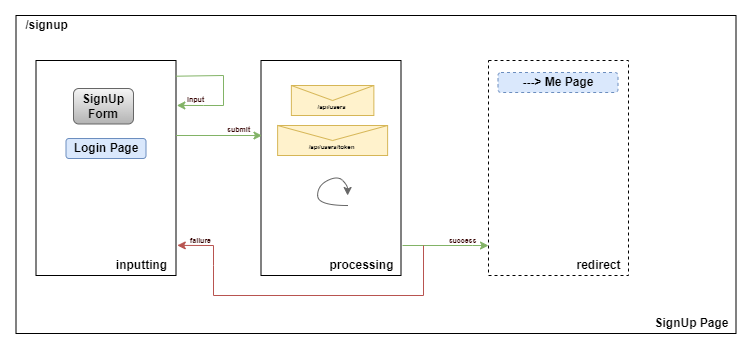

### State Machine

---

## Me Page

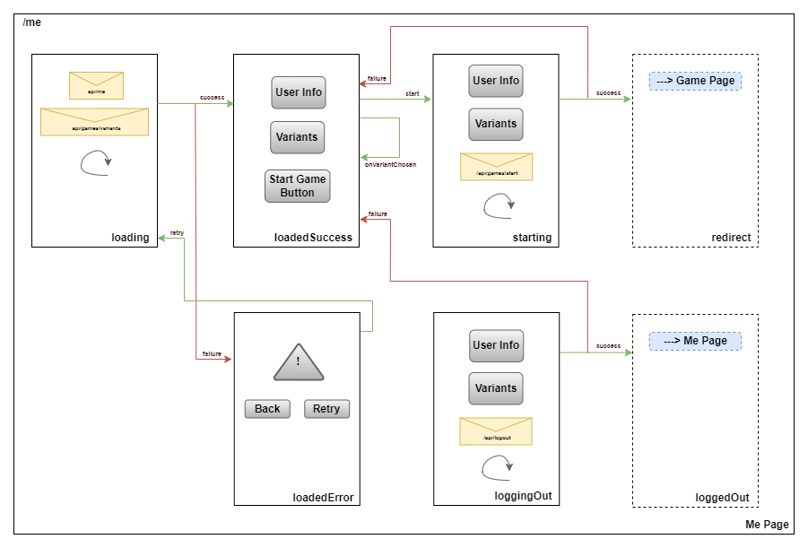

### State Machine

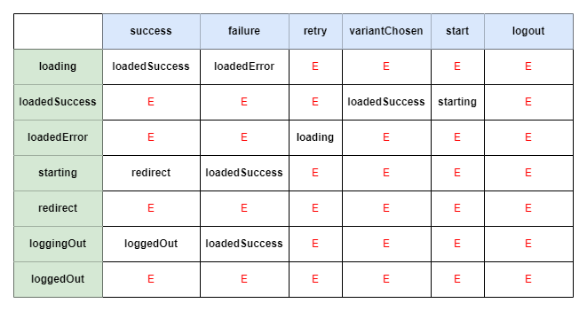

---

## Ranking Page

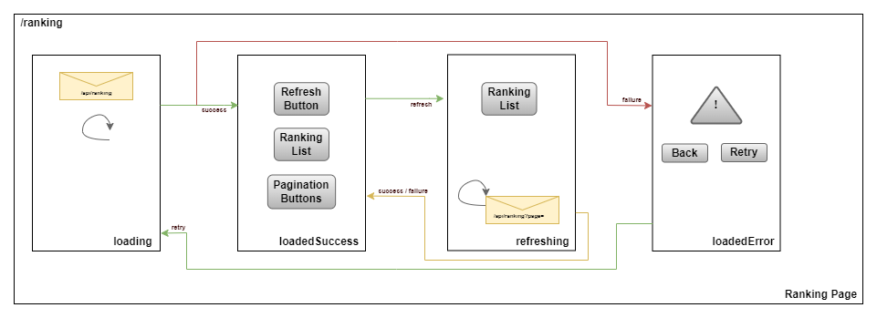

### State Machine

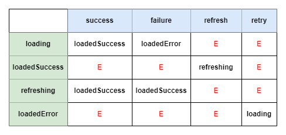

---

## User Statistics Page

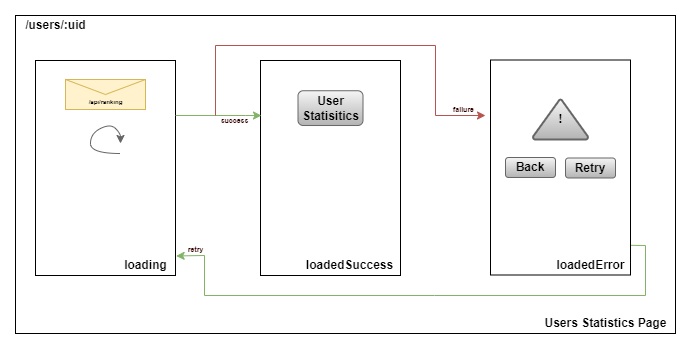

### State Machine

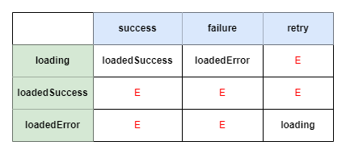

---

## Game Page

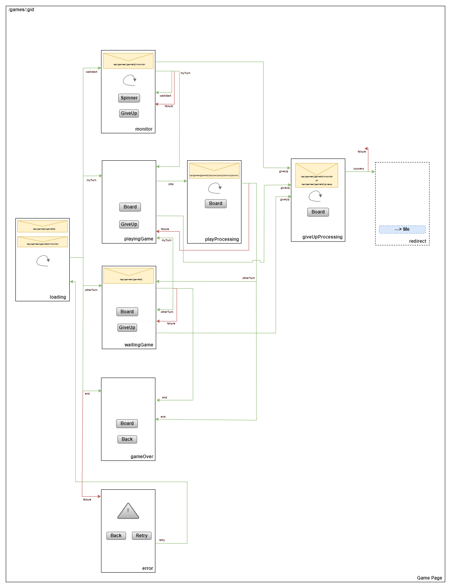

### State Machine

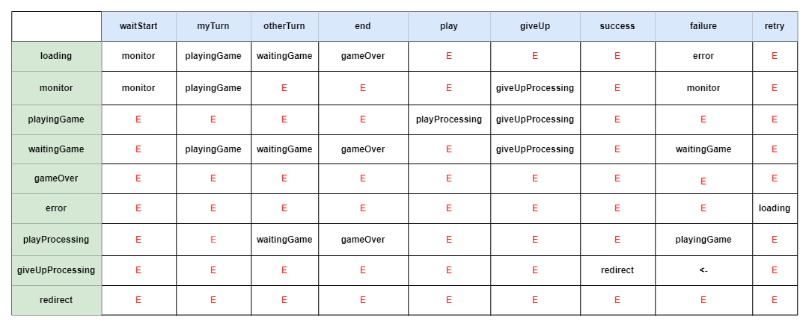

----

# Main implementation challenges

## 1. Polling

Given the problem that useEffect cannot be used in conditional code and the elements present in the dependency array cause 
a new execution of the effect when it is changed and given the need to poll the game and/or the monitor, it was decided to use 
useEffect only for the initial load and all subsequent ones appear in subsequent requests. In other words, if after a request 
to the API the result is success and different from the current state transit, otherwise define a setTimeout and repeat the 
process described.

## 2. Initial loading of siren links and siren actions

Given the need to know the API uris of the resources in advance in the initial requests for each page, it was decided to make 
a first request to the API for the home resource when initially loading the application, requesting the "recipes" for 
subsequent requests.

## 3. Context and Cookies
 
Given the problem of the context not being preserved after reloading the application and the need to maintain the user session, 
it was decided to use an extra cookie for this verification. The "token" cookie with the user's token is, among others, httpOnly, 
thus ensuring that the JavaScript code cannot consult or change it, however the "login" cookie is not, among others, httpOnly, 
and can therefore be consulted and changed by Javascript code. This extra “login” cookie allows to check whether the user is 
logged in, given that it has the same expiration date as the token cookie, if the “login” cookie exists it is assumed that the 
“token” cookie exists and the user is logged in.