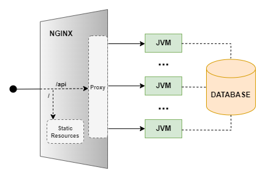

# Project 

The following figure represents the complete architecture of the developed project.

The [nginx](https://www.nginx.com/) reverse proxy will forward '/api/' requests to the available upstreams 
through dynamic service discovery and '/' requests to Static Resources (index.html and main.js). 

The only component where there is state is in the Database, being the link between the upstreams.

The backend internal software organization, the data model, and the main implementation challenges are described in
[Technical Document Backend](./technical-document-backend.md).

The frontend internal software organization and the main implementation challenges are described in
[Technical Document](./technical-document-frontend.md).